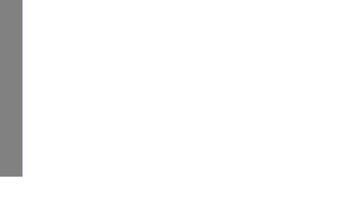
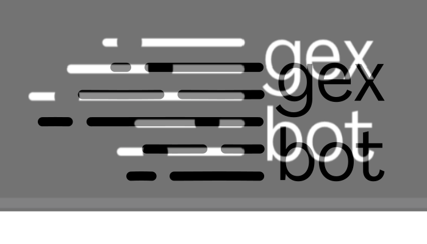
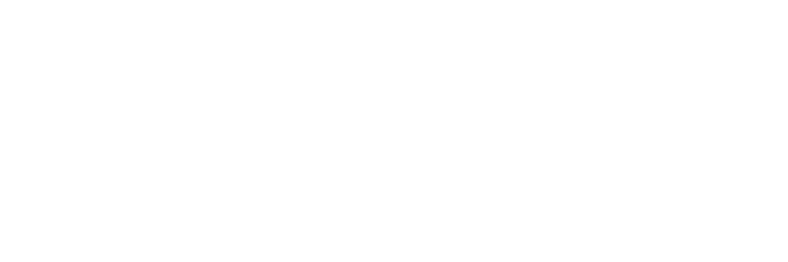

# Not Financial Advice, LLC Brand Resources

Brand guidelines and resources for Not Financial Advice, LLC and its products.

## Official Names

#### Not Financial Advice, LLC
Official company name is _Not Financial Advice, LLC_. The company is often referred to as _NFA_.

#### gexbot
The flagship product is _gexbot_. The name is written in all lowercase letters. 

The gexbot product is a trading bot that uses the gamma exposure of options to visualize the market.

## Logos

There is no official logo for _Not Financial Advice, LLC_. The logo for the _gexbot_ product is the only official logo.

Logo files are available in the `img/Logos` directory of this repository. The logos are available in the following
formats: SVG, PNG, and WebP.

There is a dark and light version of the logo. The dark version is intended for use on light backgrounds, and the light version is intended for use on dark backgrounds.

## Domains
The primary domain for the _gexbot_ product is [gexbot.com](https://gexbot.com). The domain is used for the product website and the product API.

## Social Media
#### Twitter/X
The primary social media account for the _gexbot_ product is the Twitter/X account [@thegexbot](https://twitter.com/thegexbot). The account is used for product updates and announcements and intraday market updates.
Additional Twitter/X accounts include:
- [@gexbot15](https://twitter.com/gexbot15) includes intraday market updates.
- [@gexbot_hist](https://twitter.com/gexbot_hist) includes market changes on a day-to-day timeframe.

#### Discord
The Discord server for the _gexbot_ product is [gexbot](https://discord.gg/gexbot). The server is used for product updates and announcements, intraday market updates, and community discussions.

## Colors
The primary colors for the _gexbot_ product are black and white. The black color is used for the dark version of the logo, and the white color is used for the light version of the logo.
See [color.md](color.md) for additional colors.

## Typography
The primary font for the _gexbot_ product is _Agrandir_. The font weight used are _Regular_. The font is available for download in the `font` directory of this repository.
