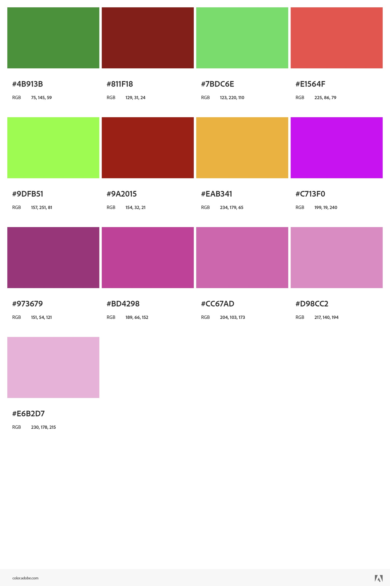

# Color
Additional colors for the _gexbot_ product are available for use in marketing materials. These colors are intended to be used as accents and should not be the primary color in any design.

▉ POSITIVE GEX OI COLOR = "#4b913b"
▉ NEGATIVE GEX OI COLOR = "#811f18"

▉ POSITIVE GEX VOL COLOR = "#7bdc6e"
▉ NEGATIVE GEX VOL COLOR = "#e1564f"

▉ MAJOR POS GAMMA COLOR = "#9dfb51"
▉ MAJOR NEG GAMMA COLOR = "#9a2015"
▉ ZERO GAMMA COLOR = "#eab341"

▉ NET CONVEXITY COLOR = "#c713f0"

▉ PRIOR 30 COLOR = "#973679"
▉ PRIOR 15 COLOR = "#bd4298"
▉ PRIOR 10 COLOR = "#cc67ad"
▉ PRIOR 5 COLOR = "#d98cc2"
▉ PRIOR 1 COLOR = "#e6b2d7"

